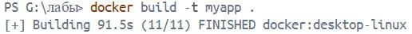
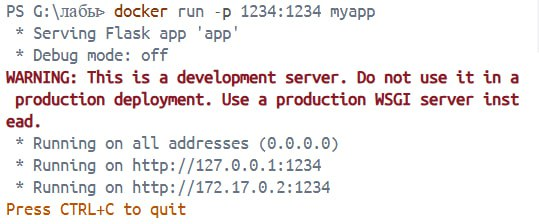
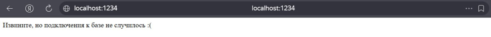

#Отчет по лабораторной работе №1
ФИО: Карунос Егор Иванович
Группа: ПИ-430Б

##Ход и описание работы.
1. Сначала была создана в пространстве компьютера папку, открыт Docker.desktop и в терминале был совершен в папку, в которой будет проводиться работа.

   
2. Далее был собран контейнер, который был назван "myapp".

   
3. Далее собранный контейнер был запущен на порте 1234.

   

   При запсуке в браузере было выведено вот такого рода сообщение:

   
