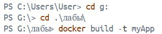

#Отчет по лабораторной работе №1
ФИО: Карунос Егор Иванович
Группа: ПИ-430Б

##Ход и описание работы.
1. Сначала создали в пространстве компьютера папку, открыли Docker.desktop и в терминале перешли в папку, в которой будем работать.

   
2. 
